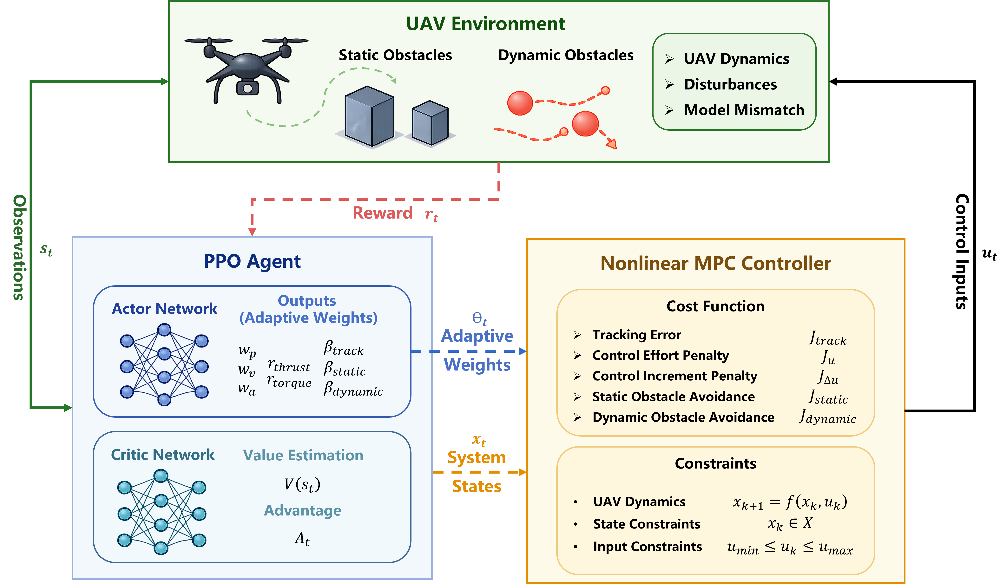

# 基于强化学习调参的 MPC 无人机轨迹跟踪与避障控制框架


## 概述
本项目实现了一个 **PPO-MPC 混合控制框架**，用于四旋翼无人机的轨迹跟踪和动态避障。核心思想是使用近端策略优化（PPO）强化学习算法，在线调整模型预测控制（MPC）的权重参数，从而在复杂环境中实现高性能的自主飞行。

## 快速开始
### 安装环境依赖
```
pip install -r requirements.txt
```

### 训练PPO策略
```
REFERENCE_KIND=curve3d DYNAMIC_OBSTACLES=1 TOTAL_TIMESTEPS=500000 \
python scripts/train_ppo_randomized_curve3d.py
```

### 运行对比实验
```
MODEL_PATH=scripts/runs/xxx/models/ppo_randomized_curve3d_final.zip \
DYNAMIC_OBSTACLES=1 SEEDS=0,1,2,3,4,5,6,7,8,9 \
python scripts/compare_ppo_mpc_vs_baseline_unified_plot_physical_obstacles.py
```

### 运行消融实验
```
MODEL_PATH=scripts/runs/xxx/models/ppo_randomized_curve3d_final.zip \
DYNAMIC_OBSTACLES=1 SEEDS=0,1,2,3,4 \
python scripts/ablation_ppo_mpc.py
```

本项目采用 MIT 许可证。详见 LICENSE 文件。
